# Migration Diagrams: shadcn/ui → Mino Experiments

**Visual Guide for Component and Styling Migration**

---

## Table of Contents

1. [Color System Migration](#color-system-migration)
2. [Component Architecture Comparison](#component-architecture-comparison)
3. [Styling Pattern Migration Flow](#styling-pattern-migration-flow)
4. [Animation System Comparison](#animation-system-comparison)
5. [File Organization Transformation](#file-organization-transformation)
6. [Migration Journey](#migration-journey)

---

## Color System Migration

### Diagram 1: Color System Comparison


### Diagram 2: OKLCH Benefits

```mermaid
mindmap
  root((OKLCH Benefits))
    Perceptual Uniformity
      Equal lightness values appear equally bright
      Better color interpolation
      Consistent contrast
    Opacity Support
      Transparent borders in dark mode
      oklch(1 0 0 / 10%) for borders
      oklch(1 0 0 / 15%) for inputs
    Future Proof
      Wide color gamut support
      HDR display ready
      CSS Color Level 4 spec
    Developer Experience
      Intuitive lightness parameter
      0 to 1 scale clear
      Easier to adjust
```

### Diagram 3: Color Mapping Table

```mermaid
graph TB
    subgraph HSL["HSL Values (shadcn)"]
        H1["0 0% 100% → White"]
        H2["0 0% 3.9% → Dark Gray"]
        H3["0 0% 98% → Light Gray"]
        H4["0 0% 14.9% → Border Dark"]
    end

    subgraph OKLCH["OKLCH Values (mino)"]
        O1["oklch(1 0 0) → White"]
        O2["oklch(0.145 0 0) → Dark Gray"]
        O3["oklch(0.985 0 0) → Light Gray"]
        O4["oklch(1 0 0 / 10%) → Transparent Border"]
    end

    H1 -->|Convert| O1
    H2 -->|Convert| O2
    H3 -->|Convert| O3
    H4 -->|Enhance| O4

    style HSL fill:#e3f2fd,stroke:#2196f3
    style OKLCH fill:#e8f5e9,stroke:#4caf50
```



---

## Component Architecture Comparison

### Diagram 4: Component Evolution


### Diagram 5: InputGroup Architecture


### Diagram 6: Component State Flow


---

## Styling Pattern Migration Flow

### Diagram 7: CVA Pattern Evolution

```mermaid
flowchart TD
    Start[Existing CVA Button] --> Check{Needs Enhancement?}

    Check -->|No| Keep[Keep Current CVA]
    Check -->|Yes| Enhance[Add Enhanced Base Classes]

    Enhance --> Focus[Add Focus Ring<br/>focus-visible:ring-[3px]]
    Focus --> ARIA[Add ARIA Styles<br/>aria-invalid:ring-destructive]
    ARIA --> SVG[Add SVG Handling<br/>[&_svg]:size-4]
    SVG --> Has[Add Has Variants<br/>has-[>svg]:px-3]
    Has --> Dark[Add Dark Mode<br/>dark:bg-input/30]

    Dark --> Test{Test Component}
    Test -->|Pass| Done[✅ Migration Complete]
    Test -->|Fail| Debug[Debug & Fix]
    Debug --> Test

    style Start fill:#e3f2fd,stroke:#2196f3
    style Done fill:#e8f5e9,stroke:#4caf50
    style Debug fill:#ffebee,stroke:#f44336
```

### Diagram 8: Migration Timeline


---

## Animation System Comparison

### Diagram 9: Animation Architecture


### Diagram 10: Animation Execution Flow


### Diagram 11: Animation Migration Decision Tree

```mermaid
flowchart TD
    Start[Component with Animation] --> Type{Animation Type?}

    Type -->|Simple fade/slide| Tailwind[Keep Tailwind Animate]
    Type -->|Complex/Interactive| Framer[Use Framer Motion]

    Framer --> Spring{Needs Physics?}
    Spring -->|Yes| UseSpring[Use SPRINGS.land/drag/ripple]
    Spring -->|No| UseTransition[Use basic transition]

    Framer --> Gesture{Needs Gestures?}
    Gesture -->|Yes| UseGesture[Add whileHover/whileTap/drag]
    Gesture -->|No| NoGesture[Skip gestures]

    Framer --> Layout{Needs Layout Animation?}
    Layout -->|Yes| UseLayout[Add layout prop]
    Layout -->|No| NoLayout[Skip layout]

    UseSpring --> Done
    UseTransition --> Done
    UseGesture --> Done
    NoGesture --> Done
    UseLayout --> Done
    NoLayout --> Done
    Tailwind --> Done[✅ Complete]

    style Start fill:#e3f2fd,stroke:#2196f3
    style Done fill:#e8f5e9,stroke:#4caf50
```



### Diagram 12: Spring Configuration Examples


---

## File Organization Transformation

### Diagram 13: Directory Structure Evolution


### Diagram 14: Component Categorization


### Diagram 15: Migration Workflow

```mermaid
flowchart TD
    Start[Start Migration] --> Backup[Create Backup Branch]
    Backup --> Analyze[Analyze Component Dependencies]

    Analyze --> Categorize{Categorize Component}

    Categorize -->|Base UI| KeepUI[Keep in components/ui/]
    Categorize -->|Feature Specific| MoveFeature[Move to feature folder]
    Categorize -->|AI Related| MoveAI[Move to ai-elements/]

    KeepUI --> UpdateImports
    MoveFeature --> UpdateImports
    MoveAI --> UpdateImports

    UpdateImports[Update All Imports] --> Test{Tests Pass?}

    Test -->|No| Debug[Debug Import Issues]
    Debug --> UpdateImports

    Test -->|Yes| Verify[Verify No Broken Imports]
    Verify --> Commit[Commit Changes]
    Commit --> Next{More Components?}

    Next -->|Yes| Analyze
    Next -->|No| Done[✅ Migration Complete]

    style Start fill:#e3f2fd,stroke:#2196f3
    style Done fill:#e8f5e9,stroke:#4caf50
    style Debug fill:#ffebee,stroke:#f44336
```



### Diagram 16: Import Path Updates


---

## Migration Journey

### Diagram 17: Developer Experience Journey


### Diagram 18: Complexity vs Impact


### Diagram 19: Technology Stack


### Diagram 20: Migration Checklist

```mermaid
flowchart TD
    Start([Start Migration]) --> P1{Phase 1: Foundation}

    P1 -->|✅| P1A[Install dependencies]
    P1A --> P1B[Update CSS variables]
    P1B --> P1C[Create spring config]
    P1C --> P1D[Update Tailwind config]

    P1D --> P2{Phase 2: Components}

    P2 -->|✅| P2A[Migrate Button]
    P2A --> P2B[Migrate Input]
    P2B --> P2C[Create InputGroup]
    P2C --> P2D[Migrate Select]
    P2D --> P2E[Add data-slot to all]

    P2E --> P3{Phase 3: Styling}

    P3 -->|✅| P3A[Add focus rings]
    P3A --> P3B[Add ARIA states]
    P3B --> P3C[Implement shadows]
    P3C --> P3D[Dark mode opacity]

    P3D --> P4{Phase 4: Animation}

    P4 -->|✅| P4A[Convert to Framer Motion]
    P4A --> P4B[Implement springs]
    P4B --> P4C[Add gestures]
    P4C --> P4D[Layout animations]

    P4D --> P5{Phase 5: Organization}

    P5 -->|✅| P5A[Create feature folders]
    P5A --> P5B[Move components]
    P5B --> P5C[Update imports]

    P5C --> P6{Phase 6: Testing}

    P6 -->|✅| P6A[Visual regression]
    P6A --> P6B[Accessibility audit]
    P6B --> P6C[Performance test]

    P6C --> Complete([✅ Migration Complete])

    style Start fill:#e3f2fd,stroke:#2196f3
    style Complete fill:#e8f5e9,stroke:#4caf50
```



---

## Rendering These Diagrams

### In GitHub
These Mermaid diagrams render natively in GitHub markdown files.

### In VS Code
Install the "Markdown Preview Mermaid Support" extension.

### Online
Use [Mermaid Live Editor](https://mermaid.live) to edit and preview.

### In Documentation Sites
Most modern documentation platforms (Docusaurus, GitBook, VitePress) support Mermaid natively.

---

## Diagram Legend

**Colors:**
- 🔵 Blue: shadcn/ui original state
- 🟢 Green: mino-experiments target state
- 🟠 Orange: In-progress/transition state
- 🔴 Red: Error/debug state
- ⚪ Gray: Neutral/common elements

**Diagram Types:**
- **Flowchart**: Process flows and decision trees
- **Graph**: System architecture and relationships
- **Class Diagram**: Component structure
- **Sequence Diagram**: Interaction flows
- **Gantt Chart**: Timeline planning
- **Journey Diagram**: Experience mapping
- **Mindmap**: Categorization
- **Quadrant Chart**: Prioritization

---

## Next Steps

1. Review each diagram section
2. Use diagrams during team discussions
3. Reference during implementation
4. Update diagrams as patterns evolve
5. Add custom diagrams for project-specific patterns

**Happy migrating!** 🚀
